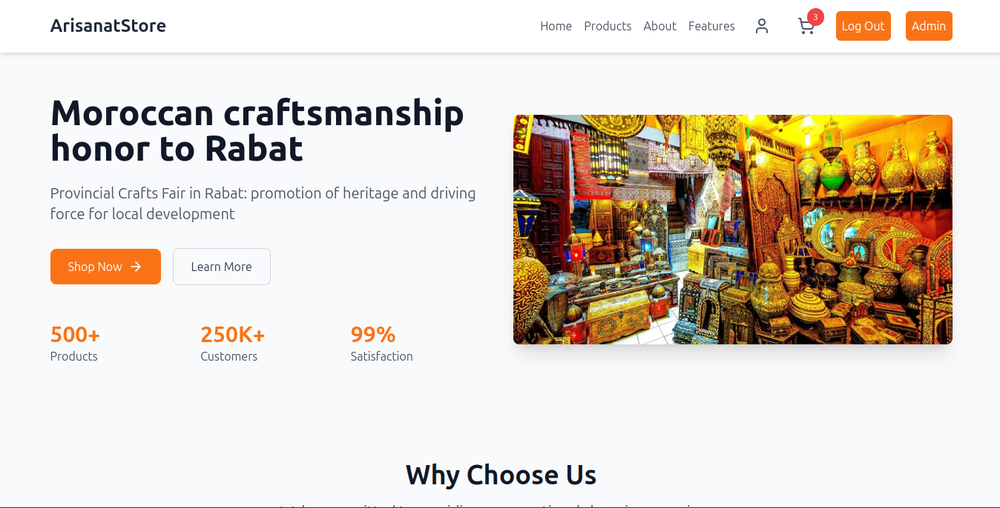
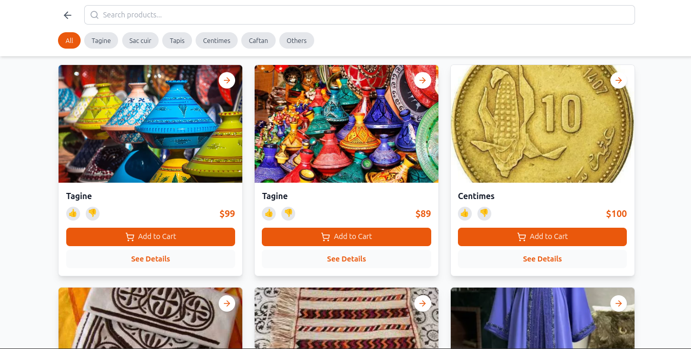
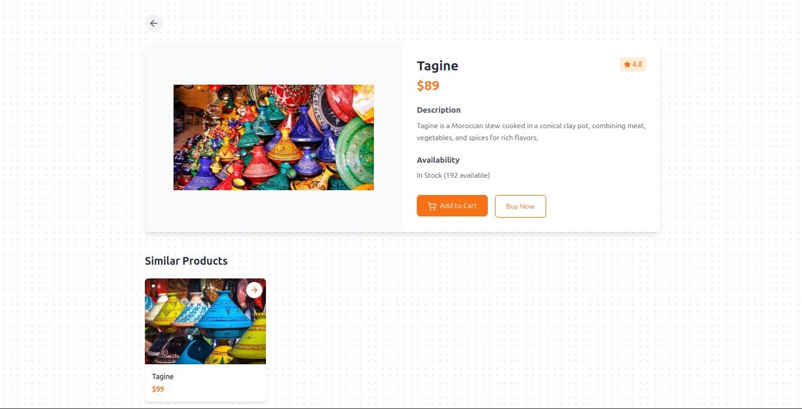
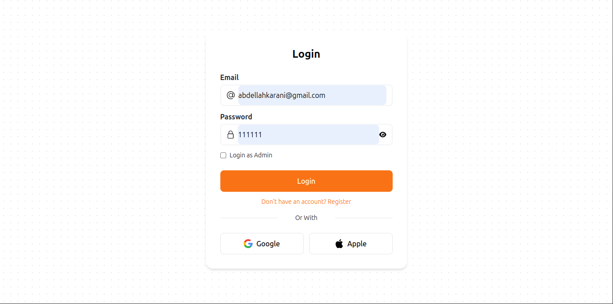
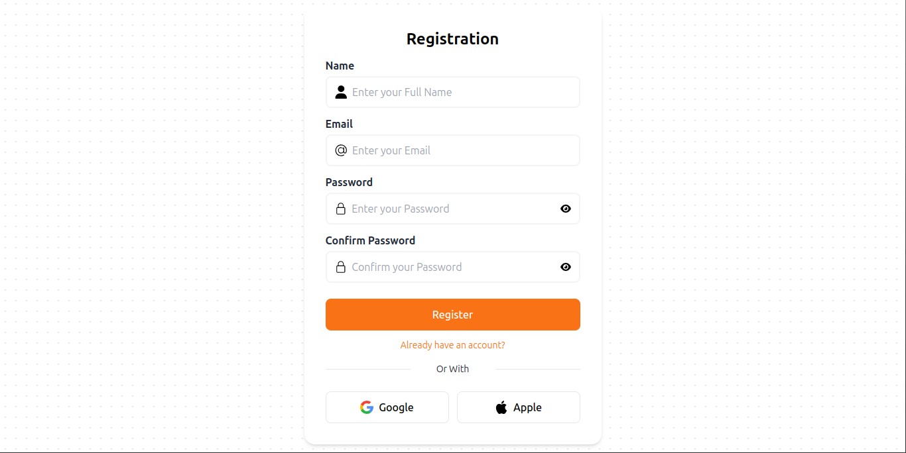
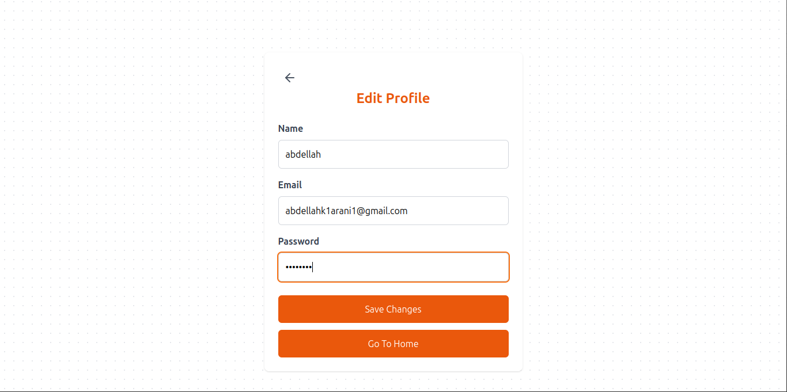
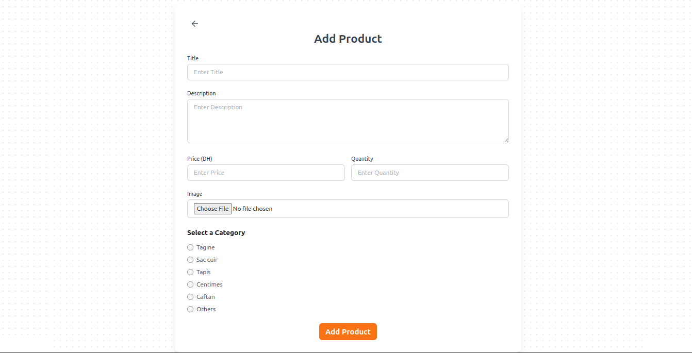
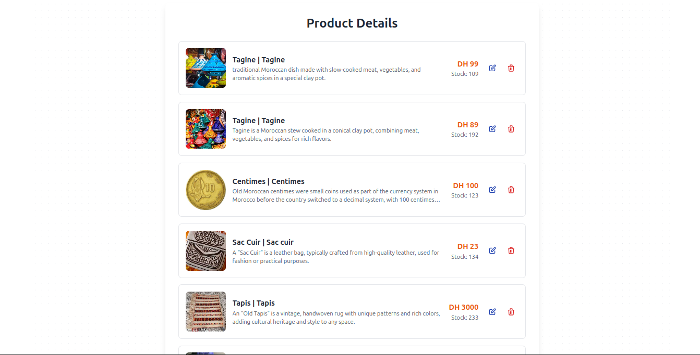

# E-commerce Platform

### Main Page



### Products Page



### Products Details


    <ProductDisplay
          products={products}
          setProducts={setProducts}
          onUpdate={handleUpdateRequest}
        />

### Login Page



### Registration Page



### Profile Page



### Admin Dashboard Page



### Admin Dashboard Page



## Project Overview

This project is an e-commerce website with different spaces for regular users and administrators. It connects user authentication with inventory management to create a complete online shopping experience.

## Main Features

### For Regular Users

- **Shop Page**: Browse all products displayed as cards
- **Product Details Page**:
  - Full product description
  - Technical details
  - Similar products section
- **User Profile Management**:
  - Update personal information (name, email, password)

### For Administrators

- Access to product management dashboard
- Inventory control
- User management functions

## Technology Stack

<div align="center">
  
[](https://developer.mozilla.org/en-US/docs/Web/HTML) 
[](https://developer.mozilla.org/en-US/docs/Web/CSS)
[](https://developer.mozilla.org/en-US/docs/Web/JavaScript/Frameworks/React)
[](https://michalsnik.github.io/aos/)
[](https://expressjs.com/)
[](https://www.postman.com/)
[](https://www.mongodb.com/)
[](https://developer.mozilla.org/en-US/docs/Web/JavaScript)

</div>

## Project Workflow

1. **User Login**:

   - Users sign in with email/password
   - System checks user role (admin or regular user)
   - Redirects to appropriate dashboard based on role

2. **Shopping Experience**:

   - Browse products in the shop
   - View detailed product information
   - Manage personal profile

3. **Admin Functions**:
   - Manage product inventory
   - View user information
   - Monitor shop performance

## Contribution

**Clone the repository**

```bash

   git clone https://github.com/KaraniAbdellah/ecom_react.git

```
